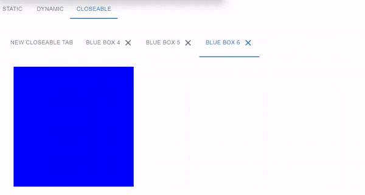

# Closeable Tabs in React

## :eyes: Overview
Closeable tabs is an important functionality when designing an easy and practice user experience.
In this React Project, you will find a solution for creating Dynamic and Closeable tabs and easily
it can be adapted to any type of project (Javascript Stack).

## :warning: Important
This project uses Material UI, where is an open-source React component library that implements **Google's Material Design**. It's comprehensive and can be used in production out of the box.

## :technologist: Audience
This project is designed for people familiar with HTML, React App, Material Design and typescript development.

## :triangular_flag_on_post: Prerequisites
There isn't any prerequisites to run this solution, only download all dependences (npm install).

## :hammer: Dependencies
- typescript
- @mui/material
- @mui/lab
- @mui/icons-material
- @emotion/styled
- @emotion/react

## :clap: Special Thanks
Mathieu Media that created youtube videos for this soluction in Javascript.
[Follow this link to his youtube channel.](https://www.youtube.com/@MathieuMedia) 

## :page_facing_up: License
This project is MIT Licensed

